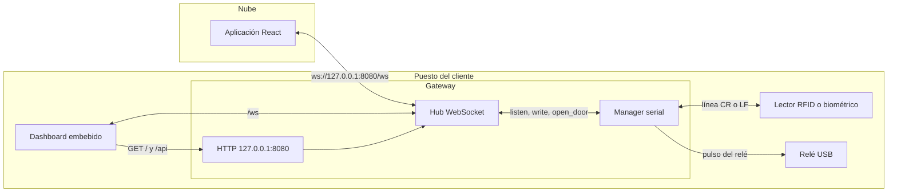
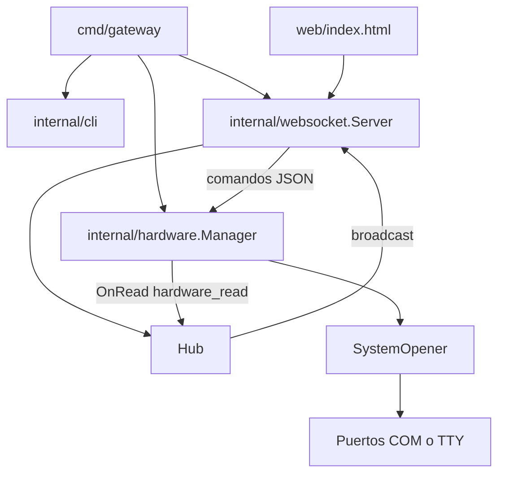
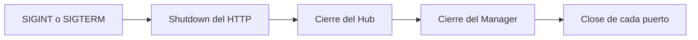

# HE Gateway

Gateway local, en un solo binario, entre la aplicación web y los dispositivos seriales del puesto (lectores RFID, biométricos, relés USB). Escucha en loopback, acepta comandos JSON por WebSocket y publica las lecturas de hardware a los navegadores conectados.

## Arquitectura

La web en la nube y el dashboard local comparten el mismo WebSocket. El gateway traduce comandos JSON a escrituras seriales y convierte cada línea leída en un evento para todos los clientes.



Dentro del binario, `cmd/gateway` arma las piezas e inyecta el manager de hardware en el servidor WebSocket. La lectura serial no pasa por HTTP: el callback `OnRead` publica directo en el hub.



Al recibir SIGINT o SIGTERM el proceso deja de aceptar conexiones, cierra los WebSocket y después libera los puertos.



El detalle de cada mensaje está en [docs/integracion.md](docs/integracion.md).

## Entorno de desarrollo

Hace falta Go 1.25 o posterior. El acceso serial es Go puro y el dashboard vive en `web/index.html`, embebido en el binario. Tailwind se carga desde el CDN al abrir el dashboard.

| Sistema | Instalación |
| --- | --- |
| macOS | `brew install go` |
| Linux | el paquete `golang` de la distribución, si es 1.25 o posterior, o el tarball de [go.dev/dl](https://go.dev/dl/) |
| Windows | el instalador de [go.dev/dl](https://go.dev/dl/) |

Comprueba la versión y, desde la raíz del repositorio, descarga los módulos de `go.mod`:

```bash
go version
go mod download
```

`go run`, `go test` y `go build` también los bajan si faltan. Las dependencias directas son estas:

| Módulo | Uso |
| --- | --- |
| `github.com/gorilla/websocket` | Servidor WebSocket en `/ws` |
| `go.bug.st/serial` | Abrir, leer y escribir puertos COM y TTY |
| `golang.org/x/sys` | Indirecta. Llamadas al sistema que usa el paquete serial |

Para una implementación nueva, añade la librería con `go get`. Eso actualiza `go.mod` y `go.sum`:

```bash
go get github.com/ejemplo/paquete@latest
```

Mantén `CGO_ENABLED=0`: una dependencia que enlace C obliga a tener un compilador de C en cada sistema de destino y rompe el binario estático descrito en [docs/compilacion.md](docs/compilacion.md). Los tests de `tests/` simulan el puerto, así que se pueden correr sin un lector ni un relé conectados.

## Ejecutar

Sin flags, el ejecutable genera un certificado local, pide permiso una vez y abre el dashboard en [https://127.0.0.1:8080](https://127.0.0.1:8080). El detalle está en [docs/certificados.md](docs/certificados.md).

En desarrollo, `-http` evita ese paso y deja el proceso en HTTP:

```bash
go run ./cmd/gateway -http
```

El dashboard queda en [http://127.0.0.1:8080](http://127.0.0.1:8080).

```bash
go run ./cmd/gateway -http -addr 127.0.0.1:8080 -baud 9600 -devices COM3,/dev/ttyUSB0
```

`Ctrl+C` (SIGINT o SIGTERM) cierra el HTTP, las conexiones WebSocket y los puertos seriales.

| Flag | Default | Uso |
| --- | --- | --- |
| `-addr` | `127.0.0.1:8080` | Dirección HTTP |
| `-devices` | vacío | Puertos a escuchar al arrancar, separados por coma |
| `-baud` | `9600` | Velocidad 8N1 |
| `-pulse` | `300ms` | Ancho del pulso del relé. `0` lo deja activado |
| `-open-hex` | `A00101A2` | Trama de apertura (relé LCUS-1) |
| `-close-hex` | `A00100A1` | Trama de cierre |
| `-log-json` | false | Logs `slog` en JSON |
| `-http` | false | HTTP plano, sin el certificado automático |
| `-cert`, `-key` | vacío | PEM propios. No instala la autoridad local |

Sin flags, la aplicación React se conecta a `wss://127.0.0.1:8080/ws`. Con `-http`, la dirección es `ws://127.0.0.1:8080/ws`. El proceso escucha solo en loopback y acepta cualquier `Origin`, porque la web en la nube es otro origen. `-cert` y `-key` se usan juntos cuando el certificado ya existe; en ese caso tampoco se toca el almacén del sistema.

## Protocolo

Comando desde la web:

```json
{"action":"open_door","device_id":"COM3"}
```

Lectura emitida por un lector (una línea terminada en CR o LF):

```json
{"event":"hardware_read","data":"12345678","device_id":"COM3"}
```

Otras acciones: `listen`, `stop_listen`, `list_ports` y `write` (`payload` de texto, máximo 1024 bytes). `open_door` escribe la trama de apertura y, tras `-pulse`, la de cierre. Si el puerto ya está en escucha, la escritura reutiliza esa conexión.

`GET /api/ports` y `GET /api/status` alimentan el dashboard.

## Pruebas

No hace falta hardware conectado. Los tests viven en `tests/` y usan un mock de `SerialDevice`.

```bash
go test ./...
go test -race ./tests/...
```

## Compilar

El puesto de destino solo necesita el binario. Los comandos por sistema están en [docs/compilacion.md](docs/compilacion.md).
