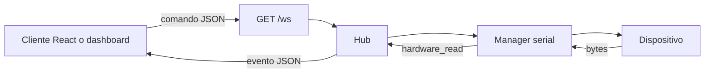
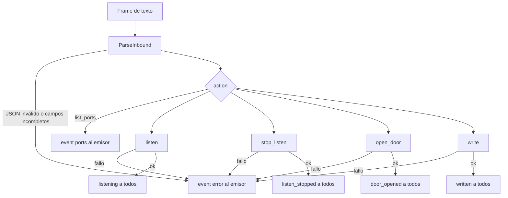
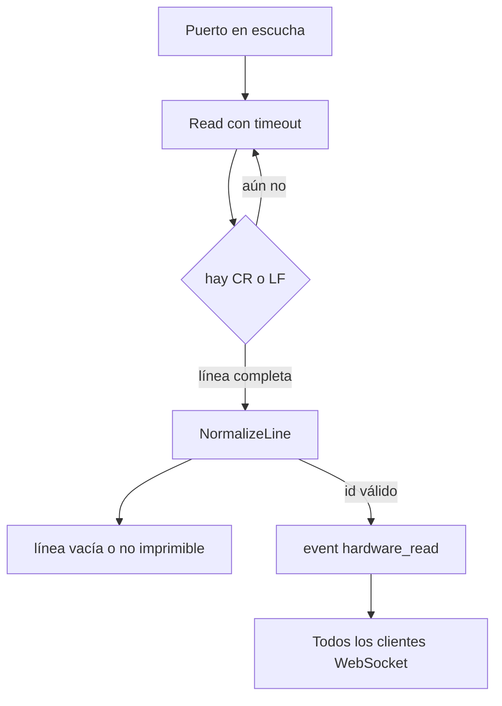

# Guía de integración

La aplicación en la nube habla con el hardware local a través del gateway que corre en el puesto del cliente. El canal es un WebSocket en texto: cada frame lleva un solo objeto JSON.



Dirección por defecto, al abrir el ejecutable:

```text
wss://127.0.0.1:8080/ws
```

El proceso escucha solo en loopback y acepta cualquier `Origin`. El certificado local se crea al arrancar, como describe [certificados.md](certificados.md). `-http` deja el canal en `ws://127.0.0.1:8080/ws`. `-cert` y `-key` usan unos PEM ya creados.

Arranque en el puesto:

```bash
go run ./cmd/gateway -addr 127.0.0.1:8080 -baud 9600 -devices COM3
```

`-devices` abre la escucha al arrancar. Sin ese flag, la web envía `listen` cuando quiere recibir lecturas. La velocidad por defecto es 9600 8N1 para todos los puertos.

## Conexión

Un cliente abre el socket y espera mensajes. Al conectar, el gateway envía, en este orden:

1. Saludo solo para ese cliente. `data` es la cantidad de clientes conectados, como texto.

```json
{"event":"hello","data":"1"}
```

2. Hasta 50 eventos recientes ya emitidos a todos (`hardware_read`, `door_opened`, `listening`, `listen_stopped`, `written`).
3. Aviso de clientes, también difundido al resto:

```json
{"event":"clients","data":"1"}
```

Si el socket se cae, el cliente vuelve a conectar. El saludo y el historial reciente llegan otra vez.

Cada comando tiene 5 segundos para terminar. Un mensaje de entrada no puede pasar de 4096 bytes.

## Enviar datos

Un frame de entrada se valida y, si la acción toca hardware, el resultado se difunde a todos los sockets. `list_ports` y los errores vuelven solo a quien envió el comando.



El cliente escribe un frame de texto con un único objeto JSON. `action` es obligatorio. `device_id` identifica el puerto (`COM3` en Windows, `/dev/ttyUSB0` en Linux). Se recortan espacios alrededor de `action` y `device_id`. El id no puede estar vacío, pasar de 128 caracteres ni contener saltos de línea o bytes nulos.

| Acción | Campos | Qué hace |
| --- | --- | --- |
| `list_ports` | ninguno | Devuelve los puertos que ve el sistema operativo |
| `listen` | `device_id` | Abre el puerto y deja una lectura continua |
| `stop_listen` | `device_id` | Cierra esa lectura |
| `open_door` | `device_id` | Pulsa el relé de ese puerto |
| `write` | `device_id`, `payload` | Escribe el texto tal cual en el puerto |

`list_ports` no usa `device_id`. Las demás acciones sí. `payload` es obligatorio en `write`, como texto de hasta 1024 bytes. El gateway no le agrega un salto de línea: si el dispositivo lo espera, va dentro del string (`"PING\n"`).

Ejemplos:

```json
{"action":"list_ports"}
```

```json
{"action":"listen","device_id":"COM3"}
```

```json
{"action":"open_door","device_id":"COM3"}
```

```json
{"action":"write","device_id":"COM3","payload":"PING\n"}
```

```json
{"action":"stop_listen","device_id":"COM3"}
```

`open_door` escribe la trama de apertura y, tras el pulso (300 ms por defecto), la de cierre. Los bytes por defecto son el relé LCUS-1: `A0 01 01 A2` para abrir y `A0 01 00 A1` para cerrar. `-pulse 0` deja el relé activado. `-open-hex` y `-close-hex` cambian las tramas sin recompilar.

Si el puerto ya está en `listen`, `open_door` y `write` reutilizan esa conexión. Si no, la abren, escriben y la cierran.

## Recibir datos

La lectura continua solo existe después de `listen` o de `-devices`. El bucle acumula bytes hasta un CR o LF, normaliza la línea y el hub la entrega a cada cliente conectado.



Hay dos clases de mensajes de salida.

Los que responden solo a quien envió el comando:

| `event` | Cuándo |
| --- | --- |
| `hello` | Apenas conecta ese cliente |
| `ports` | Respuesta de `list_ports` |
| `error` | JSON inválido o fallo del comando |

Los que llegan a todos los clientes conectados:

| `event` | Cuándo |
| --- | --- |
| `clients` | Entra o sale un cliente. `data` es el total, en texto |
| `listening` | `listen` abrió el puerto |
| `listen_stopped` | `stop_listen` lo cerró |
| `door_opened` | El pulso de `open_door` terminó |
| `written` | `write` entregó el payload. `data` repite ese texto |
| `hardware_read` | Un lector en escucha entregó un identificador |

Lectura de un lector RFID o biométrico que termina la línea en CR o LF:

```json
{"event":"hardware_read","data":"12345678","device_id":"COM3"}
```

Esa lectura solo sale si el puerto está en escucha (`listen` o `-devices`). `open_door` no inicia la lectura. El gateway parte el flujo en líneas `\n`, `\r` o `\r\n`, quita espacios y bytes nulos, e ignora líneas vacías o con caracteres de control. `data` es el identificador, como máximo 1024 caracteres.

Lista de puertos:

```json
{"event":"ports","action":"list_ports","ports":["COM3","COM4"]}
```

Si no hay puertos, `ports` es `[]`.

Confirmaciones:

```json
{"event":"listening","action":"listen","device_id":"COM3"}
```

```json
{"event":"door_opened","action":"open_door","device_id":"COM3"}
```

```json
{"event":"written","action":"write","device_id":"COM3","data":"PING\n"}
```

Error de un comando. `error` describe la causa; `action` y `device_id` indican cuál falló:

```json
{"event":"error","action":"open_door","device_id":"COM3","error":"open serial port COM3: no such file or directory"}
```

Un JSON mal formado no trae `action`:

```json
{"event":"error","error":"parse message: unexpected end of JSON input"}
```

Un comando fallido no cierra el socket. El cliente puede seguir enviando.

## Flujo de un lector y una puerta

El lector de huella habla solo con el gateway, por el puerto serial. El API REST está en la nube y no abre ese puerto. El cliente web es el puente: recibe `hardware_read` por WebSocket y llama al API; con la respuesta, manda `open_door` de vuelta al gateway.

```mermaid
flowchart TB
  subgraph identificar ["Flujo 1. Identificar la huella"]
    direction LR
    finger["Lector de huella"]
    gwIn["Gateway"]
    appIn["Cliente web"]
    apiIn["API REST"]
    finger -->|"línea con el ID"| gwIn
    gwIn -->|"hardware_read"| appIn
    appIn -->|"POST /identificaciones"| apiIn
  end

  subgraph autorizar ["Flujo 2. Autorizar el acceso"]
    direction LR
    apiOut["API REST"]
    appOut["Cliente web"]
    gwOut["Gateway"]
    lock["Relé o lector"]
    apiOut -->|"200 autorizado"| appOut
    appOut -->|"open_door"| gwOut
    gwOut -->|"pulso serial"| lock
  end
```



1. Conectar el WebSocket y esperar `hello`.
2. Enviar `listen` con el puerto del lector.
3. Esperar `listening`.
4. Cada tarjeta o huella llega como `hardware_read`. `data` es el id que la aplicación debe registrar.
5. Para abrir, enviar `open_door` con el puerto del relé y esperar `door_opened`.
6. Al cerrar la pantalla, enviar `stop_listen` o simplemente cerrar el proceso del gateway.

El lector y el relé pueden ser el mismo `device_id` o dos puertos distintos. Dos lectores activos producen `hardware_read` distinguibles por `device_id`.

## Ejemplo en el navegador

```javascript
const ws = new WebSocket("ws://127.0.0.1:8080/ws");

ws.onmessage = (ev) => {
  const msg = JSON.parse(ev.data);
  switch (msg.event) {
    case "hello":
      ws.send(JSON.stringify({ action: "listen", device_id: "COM3" }));
      break;
    case "hardware_read":
      console.log(msg.device_id, msg.data);
      break;
    case "error":
      console.error(msg.error);
      break;
    default:
      break;
  }
};

function openDoor(deviceId) {
  ws.send(JSON.stringify({ action: "open_door", device_id: deviceId }));
}
```

Los campos desconocidos se pueden ignorar. El gateway también ignora campos de más en el comando, siempre que `action`, `device_id` y `payload` cumplan las reglas de arriba.

## HTTP auxiliar

El dashboard usa dos GET en el mismo host. No envían ni reciben datos de hardware; el WebSocket es el canal de integración.

| Método y ruta | Cuerpo |
| --- | --- |
| `GET /api/ports` | `["COM3","COM4"]` |
| `GET /api/status` | `{"clients":1,"listening":["COM3"]}` |

Esas rutas no declaran CORS. Una página en otro origen debe usar el WebSocket, no `fetch`.
